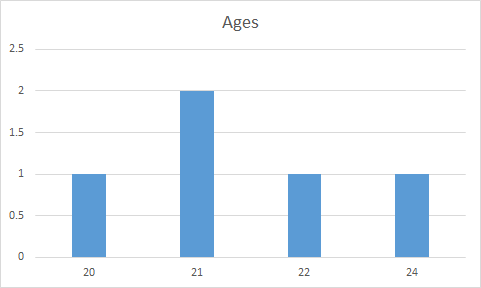
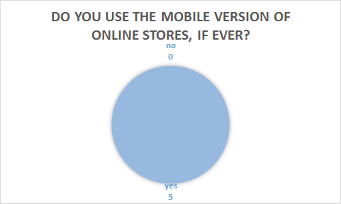
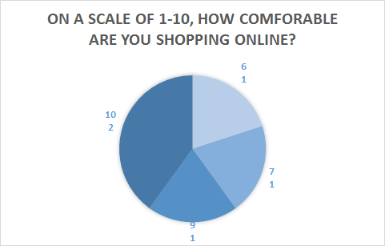
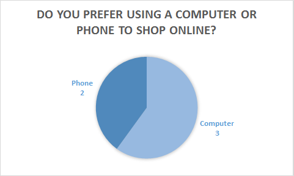
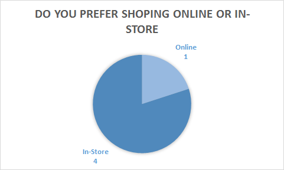

[//]: # "results.md"
[//]: # "Author: Mackenzie Goode"
[//]: # "Made for conversion with Pandoc"

Results
=======

This section covers the results of the usability tests our team conducted.

Graphs
------

User Input
----------

* Account creation and checkout processes were easy
* Clicking the account email to view the account information does nothing
* Images of the products should be larger
* *on mobile version:* menu options should be centered instead of being aligned to the right
* Viewing the cart items was a little confusing
* "Featured" items should be added as a category
* There should be more color
* Dropdown menus should be added to the menu bar so that you can choose a category of product items from any page